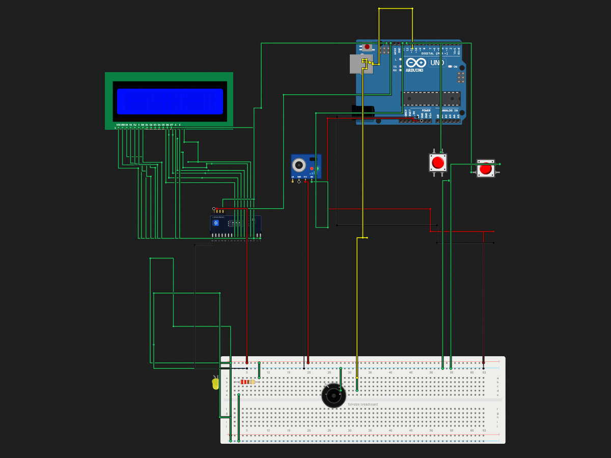

# Action Game

> Built in [Breadboard](https://breadboard.hackclub.com), a Hack Club program. This project took ~3.7 hours of work.

## What It Does

A simple game where you are given an action to perform and you are congratulated if you perform it before the time limit ends.

(I experienced an error where sometimes the buttons would automatically be in the pressed down state when the game starts and the game would just loop through itself. It can be fixed by pressing both buttons once which will reset them.)

## How It Works

The circuit is captured in `breadboard-project.json`, and the firmware that runs it is in the `firmware/` folder.

## How To Use It

Order parts listed in the BOM and connect them like in the above photo. After, flash the code from the source files using Arduino IDE.

Press any of the provided buttons to start the game when it is on the begin screen. The LCD displays a randomized action that you need to take before the time limit of 4 seconds runs out. The actions are pressing a button on either the left or right, or speaking into the microphone. If the action is completed in time the player is congratulated else they are told that they took too long. There is also an LED and buzzer that activate after starting the game and getting the action prompt.

## Demo

- **Simulate it live:** [https://breadboard.hackclub.com/share/181](https://breadboard.hackclub.com/share/181), runs the firmware in the Breadboard simulator
- **View the design:** [https://taniwankenobi.github.io/breadboard-plays/p/181/](https://taniwankenobi.github.io/breadboard-plays/p/181/)

## Schematic

The editor snapshot is in `breadboard-project.json`.

## Bill of Materials

| Part | Quantity |
| --- | --- |
| breadboard-full | 1 |
| buzzer-active | 1 |
| lcd1602 | 1 |
| lcd1602-i2c | 1 |
| led-yellow | 1 |
| microphone-module | 1 |
| pushbutton | 2 |
| resistor-220 | 1 |

## Firmware

Firmware files are in the `firmware/` folder.

## Build Journal

Build journal entries are kept in [`journals.md`](journals.md).

---

*Made in [Breadboard](https://breadboard.hackclub.com) — 3.7h of work*

